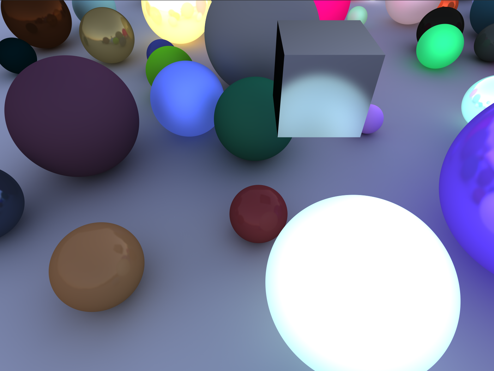

<!-- Header -->
 

  <h3 align="center">Euclidean Raytracing</h3>

  

    A Unity project that implements from scratch GPU raytracing. A Building block for a future non-euclidean raytracer. This project is roughly built off of code following the blog posts at <a href="http://three-eyed-games.com/2018/05/03/gpu-ray-tracing-in-unity-part-1/">Three eyed games</a>. Version 1.0 was written closely following those posts, everything after is more free form/ original.
  

  

# How it works

all of the rendering is handled by `RayTracingMaster.cs` on the CPU and `RayTracingShader.compute` on the GPU. `RayTracingShader.compute` runs for each pixel and determines the color using the ray tracing algorithm. My goal with this section is to formalize the mathematics of my code for easier adaptation of differential geometry/ noneuclidean techniques later on down the line.

## Theory
A ray object, , is generated, with an origin and direction. The initial ray corresponds to a random point in pixel space (`AddShader.shader` averages over multiple frames, which smoothes out the edges effectively anti-aliasing). The `Trace` function loops through every object and checks analytically whether the ray intersects the object. Included are algorithms for intersections with [planes](https://en.wikipedia.org/wiki/Line%E2%80%93plane_intersection#:~:text=In%20analytic%20geometry%2C%20the%20intersection,the%20plane%20but%20outside%20it.), [spheres](https://en.wikipedia.org/wiki/Line%E2%80%93sphere_intersection), and [triangles](http://fileadmin.cs.lth.se/cs/Personal/Tomas_Akenine-Moller/pubs/raytri_tam.pdf). The `RayTracingObject.cs` is assigned to Unity objects in the scene, it tells the shader to check intersections with any mesh triangles in the object. Of all the intersections, the closest is chosen and the `Shade` function is called to calculate the pixel color. If no intersections are found then the color is chosen from an HDRI image (the skybox).

The luminance (color) at an intersection point is given by the formula

 

That is, the color of light at a point is the sum of the light emitted at that point and the integral of all the light hitting that point. The integral is performed over the hemisphere of directions pointing away from the surface, formally 

 

 is called the BRDF (bidirectional reflectance distribution function) which is tied to the material properties of an object. Notice that  appears on both sides of the equation, this is because of the recursive nature of raytracing. For each surface that a ray bounces off of, this integeral is performed.

### Computing the Integral
In general, the integral of a function  over  is just  times the average of the function

Care must be taken with how the rays are chosen, the above equation assumes that rays are sampled using a uniform distribuiton over the hemisphere. The problem is that for our light integral some reflected rays are much more probable than others, and we would be wasting a lot of GPU time calculating rays that don't contribute much. If we sample rays according to a probability distribution function , then our average becomes

this is known as importance sampling. Ideally we would sample rays with a probabilty proportional to the BRDF, but some BRDFs may be too complex to reasonably use for sampling.

### Cosine sampling
The general probability distribution that is most useful to us is

This is a radial lobe, with a peak in the direction of  and a strength corresponding to increasing values of . We also only care about hemispheres so we restrict .  corresponds to the usual uniform distribution on the hemisphere. Random rays are sampled using this distribution in the funtion `SampleHemisphere`. The method of accomplishing this in code comes from [this](https://blog.thomaspoulet.fr/uniform-sampling-on-unit-hemisphere/) blog.

### BRDFs
When a ray hits a surface there are currently two models for how it will reflect, [diffuse](https://en.wikipedia.org/wiki/Diffuse_reflection) and [specular](https://en.wikipedia.org/wiki/Specular_reflection). 

Diffuse shading is modeled using [Lambertian reflectance](https://en.wikipedia.org/wiki/Lambertian_reflectance), with a BRDF

A convenient choice of sampling would be  (i.e. ). Putting this all together, the luminance from a diffuse reflection is calculated as

Specular shading is modeled using [Phong reflection](https://en.wikipedia.org/wiki/Phong_reflection_model) (I also wrote currently unimplemented code for the more physically accurate but computationally expensive [Blinn-Phong model](https://en.wikipedia.org/wiki/Blinn%E2%80%93Phong_reflection_model)). The Phong BRDF is

where  is the reflected ray . And . The Phong BRDF is always proportional to our cosine weighted sampling distribution, so we can simplify the luminance for specular reflections as

All materials are some combination of diffuse and specular reflections (there is also refraction which has not been implemented yet). When a ray hits a surface there is a probability for each method of reflection. We can compute this probability using the color channel averages of the `albedo` and `specular` values, for example the probability that a ray will reflect diffusely is . We will need to multiply the probability of diffuse reflection by the probability that the ray will reflect in a certain direction given diffuse reflection to get the total probability needed for importance sampling (bayes theorem). Finally we store  as a single variable. Putting this all together, the total luminance calculated in the `shade` function is

# TODO
- [ ] Texture mapping/buffering
- [ ] Depth of Field/ physical camera
- [ ] UI using Dear ImGui
- [ ] Optimization of the `Trace` function using BVHs or sparse voxel octrees
